# API-for-product-site
## Damazlle Task
### The required steps to setup the project:
* install Laravel
 ```
composer global require laravel/installer
 ```
* download code or clone it
```
 git clone https://github.com/MhdTa/API-for-product-site-Damazlle.git
```
* set database parameter in .env file
* run migrations
 ```php
 php artisan migrate
 ```
 * run the app
 ```
 php artisan serve
 ```
 ## Signin
After entering the required information, it will be verified and authenticated

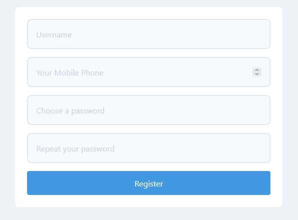
## Log in
You can also login by entering phone number and password
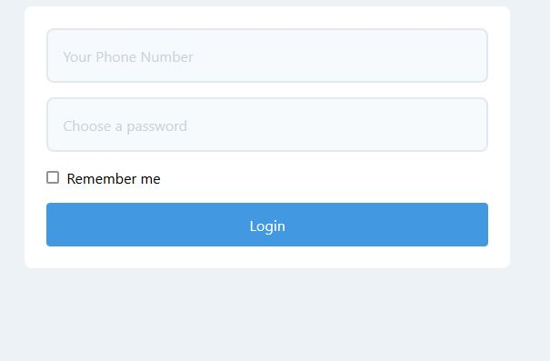
## products page
after login you can show all products and add a new product

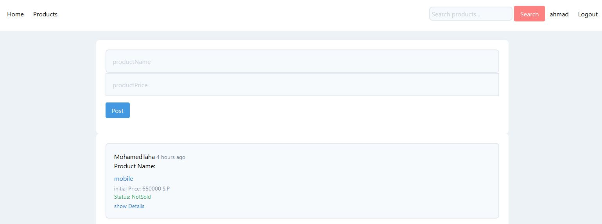
## show a product
if you click on any product you can show the details:
* Seller name
* Product Publication Date
* initial Price of product
* All bids of product
* product status (sold or not sold)
* and you can add an offer if you are logged-in
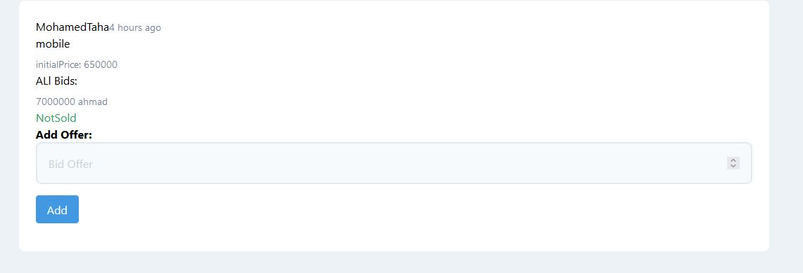
### if you are the owner of the project you can:
* edit the name or price of product
* delete the product
* sell the product if you are satisfied by the highest bid

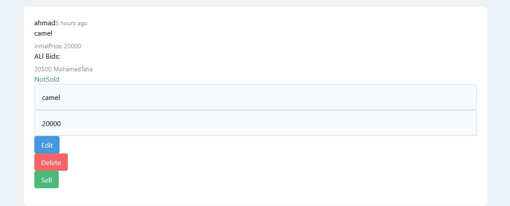
## Search for a product offered by other users by part of its name
 using laravel-searchable repo link:
 https://github.com/spatie/laravel-searchable
 only un sold products shown
 
 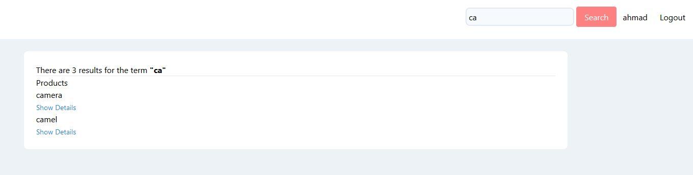
 ## Notes:
 * If you are not logged-in you can only show the products
  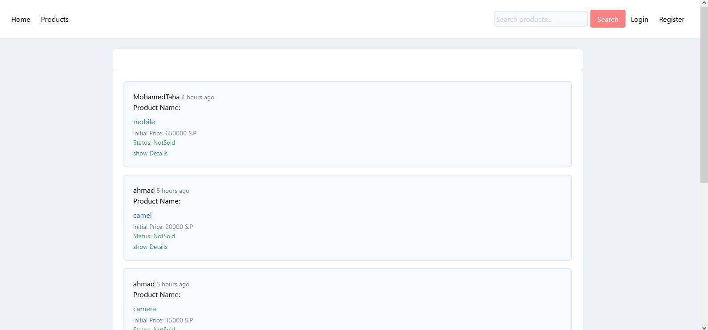
 * if you are sold the product you can not edit or delete it
  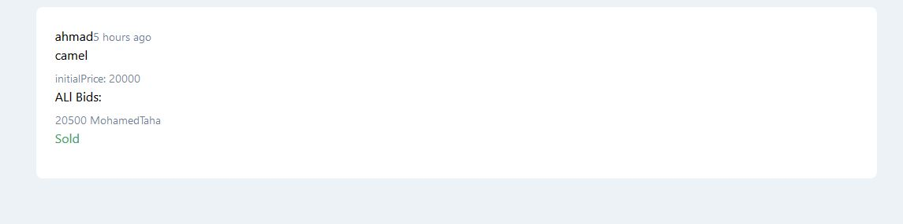
 ## DataBase:
 * User Table:
   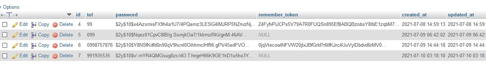
 * Product Table:
   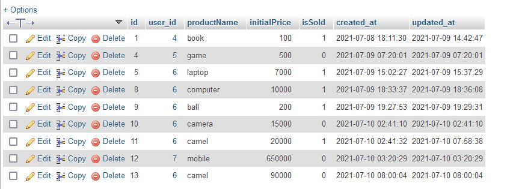 
 * BidOffer Table:
   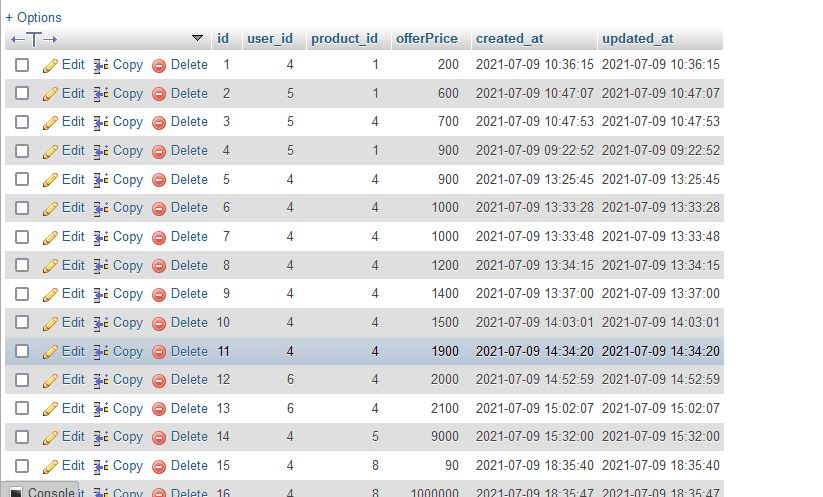 
     #
     # Hope you liked it (: (Mohamed Taha)
