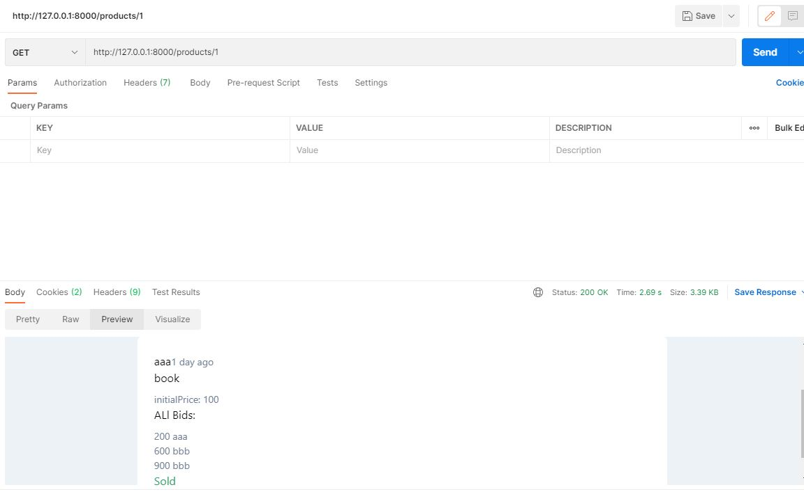

# API-for-product-site
## Damazlle Task
### The required steps to setup the project:
* install Laravel
 ```
composer global require laravel/installer
 ```
* download code or clone it
```
 git clone https://github.com/MhdTa/API-for-product-site-Damazlle.git
```
* set database parameter in .env file
* run migrations
 ```php
 php artisan migrate
 ```
 * run the app
 ```
 php artisan serve
 ```
 ## Signin
After entering the required information, it will be verified and authenticated
 ```php
    public function store(Request $request)
    {
        $this->validate($request, [
           
            'username' => 'required|max:255',
            'tel' => 'required|max:255',
            'password' => 'required|confirmed',
        ]);

        User::create([
            'username' => $request->username,
            'tel' => $request->tel,
            'password' => Hash::make($request->password),
        ]);

        auth()->attempt($request->only('tel', 'password'));

        return response($request,202);
    }
    
  ```
## Log in
You can also login by entering phone number and password
 ```php
    public function store(Request $request)
    {
        //validate the data
        $this->validate($request, [
            'tel' => 'required',
            'password' => 'required',
        ]);

        
        if (!auth()->attempt($request->only('tel', 'password'), $request->remember)) {
            return back()->with('status', 'Invalid login details');
        }

        return response()->setStatusCode(202,'user login successfully!');
    }
 ```
## products page
after login you can show all products and add a new product
 ```php
   public function index()
    {
        return Product::all();
    }

    /**
     * Store a newly created resource in storage.
     *
     * @param  \Illuminate\Http\Request  $request
     * @return \Illuminate\Http\Response
     */
    public function store(Request $request)
    {
        $request->validate([
            'name' => 'required',
            'slug' => 'required',
            'price' => 'required'
        ]);

        return Product::create($request->all());
    }
  ```
## show a product
if you click on any product you can show the details:
* Seller name
* Product Publication Date
* initial Price of product
* All bids of product
* product status (sold or not sold)
* and you can add an offer if you are logged-in

### if you are the owner of the project you can:
* edit the name or price of product
* delete the product
* sell the product if you are satisfied by the highest bid


## Search for a product offered by other users by part of its name
 using laravel-searchable repo link:
 https://github.com/spatie/laravel-searchable
 only un sold products shown
 
 
 ## Notes:
 * If you are not logged-in you can only show the products
  
 * if you are sold the product you can not edit or delete it
  
 ## DataBase:
 * User Table:
   
 * Product Table:
    
 * BidOffer Table:
    
   # Some Tests in postman:
   * get product
      
   * Search for a prduct:
       
     #
     # Hope you liked it (: (Mohamed Taha)
